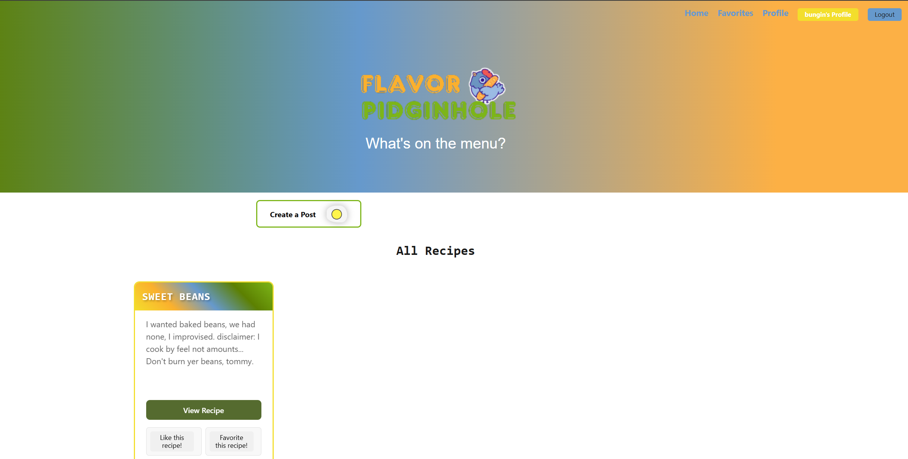
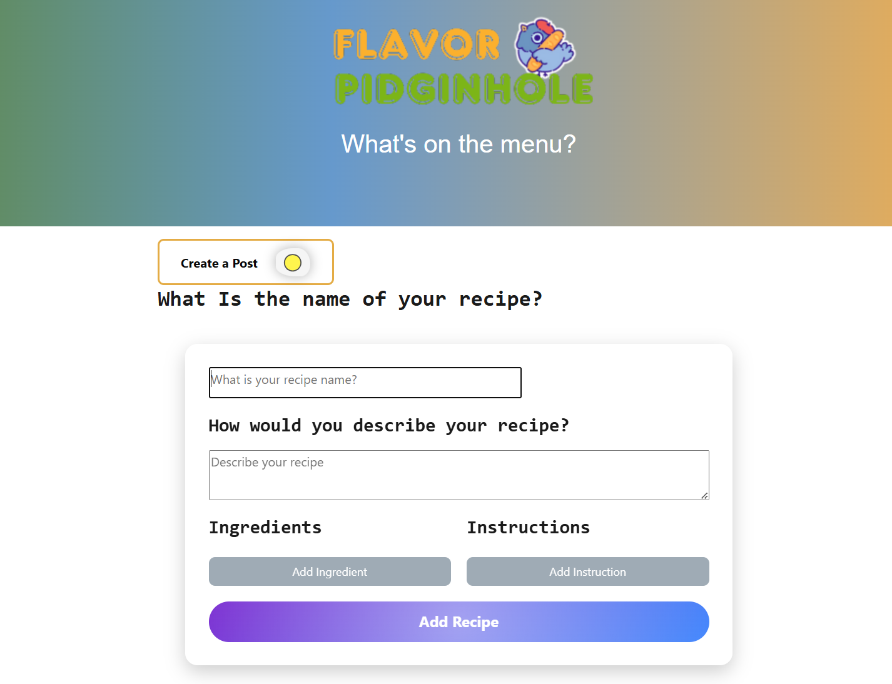
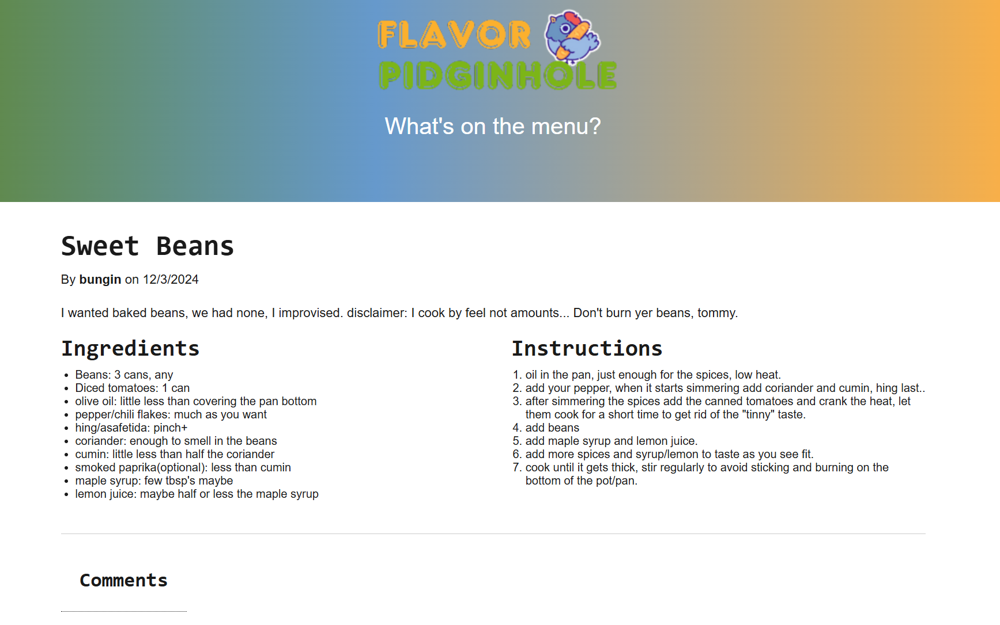

# Flavor Pidginhole

## Badges

## Description
A social media app for sharing and viewing recipes

## Table of Contents

- [Installation](#installation)
- [Usage](#usage)
- [Credits](#credits)
- [License](#license)

## Installation
npm i; npm run build; if you're running locally: make sure to set up your .env(see example file)  
you will also need MongoDb installed.

## Usage
Share and view your favorite recipes

## Credits
[Bungin/Nimai](https://github.com/bungin)  [Kvothe1387/David](https://github.com/kvothe1387)  [Lschooley3/Laura](https://github.com/lschooley3)  [Denisetruuong/Denise](https://github.com/denisetruuong)

## External Credits
Super cute pigeon from tinyarts: https://www.instagram.com/o.o_tinyarts/   https://www.redbubble.com/i/sticker/Pigeon-with-a-baguette-by-tinyartsshop/123518769.EJUG5

## License
This project is licensed under the MIT license.

(https://opensource.org/licenses/MIT)

## Features
React, MongoDB, GraphQL, Node.js, Express.js

## How to Contribute
Email me at: nimai.band@gmail.com

## Tests
n/a

## Screenshots

